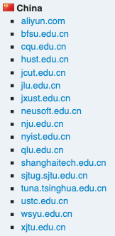
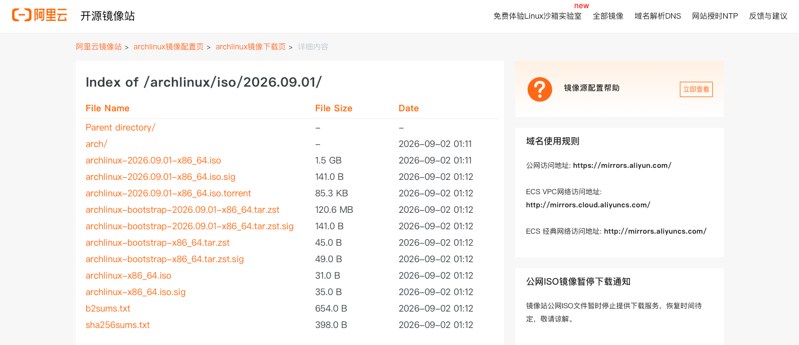

# 我们应该从制作镜像开始，这样对吗？
- 这是在仿微软式中文，不理解的没事，就当没看到就行...

1. 打开浏览器，搜索ArchLinux，或者直接访问：[ArchLinux官网链接](https://archlinux.org)

2. 选择右上角的Downloads，进入下载页面
3. 下拉，找到中国镜像站，选择一个，比如阿里云，进入镜像站。选择最新的iso文件，目前是2026.09.01的这个。（教程制作的时候似乎阿里云暂停了下载服务，所以下载不了，可以换一个镜像站，都是差不多的）

