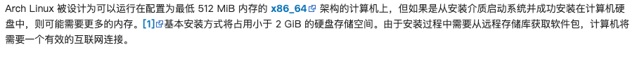

# ArchLinux中文手动安装教程@NatureCN

- 本教程介绍如何使用手动安装的方法安装ArchLinux并且进行一些基础的配置。
- 本教程的制作是配合着我新装的一台办公轻娱乐pc的安装一同制作，也可做一个分享和参考

## 从这里开始

👀 如果您是第一次查看本教程，建议按顺序阅读。以下是一些啰嗦的前言。
1. 首先请您认真仔细阅读[Arch中文Wiki中的行为准则](https://wiki.archlinuxcn.org/wiki/行为准则)，并且遵守其内容。例如假如你是为了炫耀为目的（在公开严肃场合这么做），请你离开，你很讨人厌你知道吗？
2. 这里是[Arch中文Wiki首页](https://wiki.archlinuxcn.org/wiki/首页)，教程难免存在疏漏，或者可能您的某些操作存在失误（比如打错了命令，这很容易发生），你可能会遇到各种各样的问题或者报错，此时，强大的Arch Wiki就会帮助你。你可以先查询中文Wiki，中文看着很熟悉，虽然也很完善了（大部分新手问题应该都会有），但是难免还是会存在遗漏，此时，您可以访问[ArchWiki首页](https://wiki.archlinux.org/title/Main_page)，这里更全面（Arch的社区可是出了名的庞大完善）。
- 注意：无论是开发者还是前辈们，都不可能全天24h在线接受您的提问。我们需要学会主动查阅互联网，尤其是有这么大型的Wiki在这。我们遇到的99%（甚至更多）的问题，在Wiki中都存在了，这也是在培养我们自主解决问题的能力。
3. Arch Linux对电脑硬件的需求非常低，肯定比最新的Windows低的多，这是毋庸置疑的，具体请看下图。我相信你的配置肯定是可以满足的（对吧），所以请不要担心配置需求问题。

    

4. 明明官方有教程了，为什么我还写这么一篇教程？
- 因为这是我除了个人主页外的第一个公开项目，也是我熟悉GitHub，熟悉开元社区，学习计算机语言的过程，但是这样我依旧会用心对待
- 因为这会结合我自己的使用经历做的教程，也带有一定的分享性质
